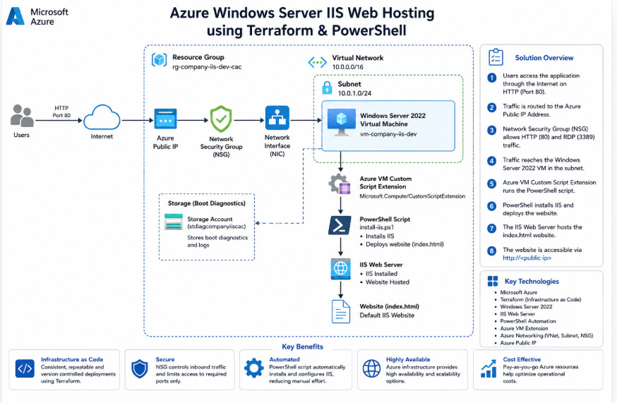
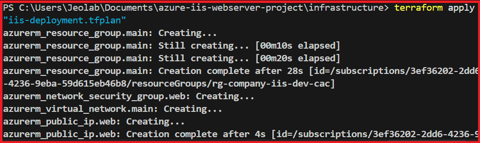
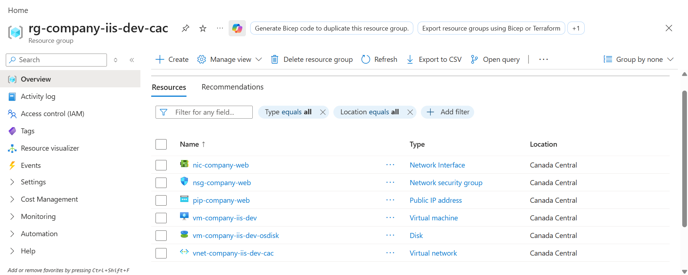
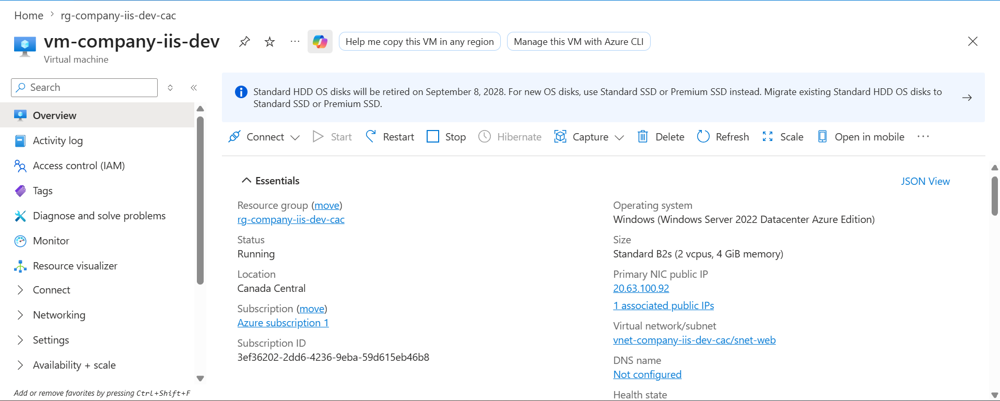
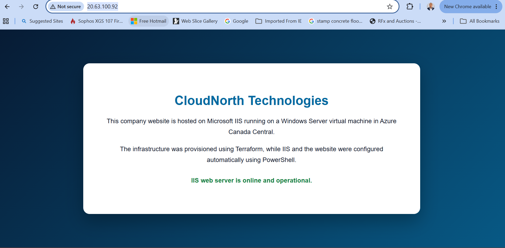

# Azure Windows Server IIS Web Hosting using Terraform & PowerShell
# Project Overview

This project demonstrates how to provision a complete Microsoft Azure infrastructure using **Terraform (Infrastructure as Code)** and automatically configure a **Windows Server 2022 Virtual Machine** to host a website using **Internet Information Services (IIS)**.

The entire deployment is fully automated. Terraform provisions the Azure infrastructure, while a PowerShell script executed through the Azure VM Custom Script Extension installs IIS and deploys a sample HTML webpage.

The project demonstrates practical cloud engineering skills including:

- Infrastructure as Code (IaC)
- Azure Virtual Machine deployment
- Azure Networking
- PowerShell automation
- Azure CLI
- Windows Server Administration
- Git & GitHub version control

# Solution Architecture

The solution consists of the following Azure resources:

- Resource Group
- Virtual Network
- Subnet
- Network Security Group (NSG)
- Public IP Address
- Network Interface (NIC)
- Windows Server 2022 Virtual Machine
- Azure VM Custom Script Extension
- IIS Web Server
- HTML Website

## Architecture Diagram

<p align="center">

</p>

---

# Solution Workflow

```text
Internet
    │
    ▼
Azure Public IP
    │
    ▼
Network Security Group
    │
    ▼
Network Interface
    │
    ▼
Windows Server 2022 VM
    │
    ▼
Azure Custom Script Extension
    │
    ▼
PowerShell Script
    │
    ▼
Install IIS
    │
    ▼
Deploy HTML Website
```

---

# Technologies Used

| Technology | Purpose |
|------------|---------|
| Microsoft Azure | Cloud Platform |
| Terraform | Infrastructure as Code |
| Azure CLI | Azure Resource Management |
| PowerShell | VM Configuration Automation |
| Windows Server 2022 | Web Server |
| IIS | Web Hosting |
| Git | Version Control |
| GitHub | Source Code Repository |
| Visual Studio Code | Development Environment |

---

# Infrastructure Deployed

The deployment provisions the following Azure resources:

- Azure Resource Group
- Azure Virtual Network
- Azure Subnet
- Network Security Group
- Public IP Address
- Network Interface Card
- Windows Server 2022 Virtual Machine
- Azure VM Extension
- IIS Web Server
- HTML Landing Page

---

# Deployment Steps

## 1. Clone Repository

```bash
git clone https://github.com/jeolab10/azure-iis-webserver-project.git
```

---

## 2. Navigate to Infrastructure Folder

```bash
cd infrastructure
```

---

## 3. Initialize Terraform

```bash
terraform init
```

---

## 4. Validate Configuration

```bash
terraform validate
```

---

## 5. Review Deployment Plan

```bash
terraform plan
```

---

## 6. Deploy Infrastructure

```bash
terraform apply
```

Terraform provisions all Azure resources automatically.

---

## 7. Automatic IIS Installation

After the virtual machine is created, Terraform executes a PowerShell script using the Azure VM Custom Script Extension to:

- Install IIS
- Enable HTTP
- Deploy the sample website

---

## 8. Verify Deployment

Open the browser using the VM Public IP:

```
http://20.63.100.92 
```

The default IIS website should load successfully.

---

# Project Screenshots

## Solution Architecture

<p align="center">

</p>

---

## Terraform Deployment

Terraform successfully provisioned the Azure infrastructure.

<p align="center">

</p>

---

## Azure Resource Group

Azure Resource Group containing all deployed resources.

<p align="center">

</p>

---

## Azure Virtual Machine

Windows Server 2022 Virtual Machine deployed successfully.

<p align="center">

</p>

---

## IIS Website

Website successfully hosted on IIS.

<p align="center">

</p>

---

# Skills Demonstrated

## Cloud Engineering

- Azure Infrastructure Deployment
- Infrastructure as Code
- Azure Networking
- Azure Compute
- Azure Resource Management

---

## DevOps

- Terraform
- Git
- GitHub
- Version Control
- Automation

---

## System Administration

- Windows Server 2022
- IIS Administration
- PowerShell Scripting
- Remote VM Configuration

---

## Networking

- Virtual Networks
- Subnets
- Network Security Groups
- Public IP Configuration

---

## Automation

- VM Custom Script Extension
- Infrastructure Provisioning
- Automated Web Server Configuration

---

# Repository Structure

```
azure-iis-webserver-project/
│
├── infrastructure/
│   ├── main.tf
│   ├── variables.tf
│   ├── outputs.tf
│   ├── providers.tf
│   ├── versions.tf
│   └── terraform.tfvars.example
│
├── scripts/
│   └── install-iis.ps1
│
├── website/
│   └── index.html
│
├── screenshots/
│   ├── architecture-diagram.png
│   ├── terraform-apply.png
│   ├── azure-resource-group.png
│   ├── azure-vm.png
│   └── website-homepage.png
│
├── README.md
└── .gitignore
```

---

# Future Improvements

The project can be enhanced by implementing:

- Azure Application Gateway
- Azure Load Balancer
- HTTPS using Azure Key Vault Certificates
- Azure Monitor & Log Analytics
- Remote Terraform State using Azure Storage
- GitHub Actions CI/CD Pipeline
- Azure Bastion
- Availability Sets / Availability Zones
- VM Scale Sets
- Azure Backup
- Custom Domain Configuration
- Azure Front Door

---

# Learning Outcomes

Through this project I gained practical experience with:

- Microsoft Azure
- Terraform
- Azure CLI
- PowerShell Automation
- Windows Server Administration
- IIS Configuration
- Infrastructure as Code
- Cloud Networking
- GitHub Portfolio Development

---

# Author

**Joseph Alabi**

Cloud Infrastructure Engineer | Azure Administrator | DevOps Engineer

GitHub:
https://github.com/jeolab10

LinkedIn:
www.linkedin.com/in/josephalabi

---

## License

This project is provided for learning and portfolio demonstration purposes.
